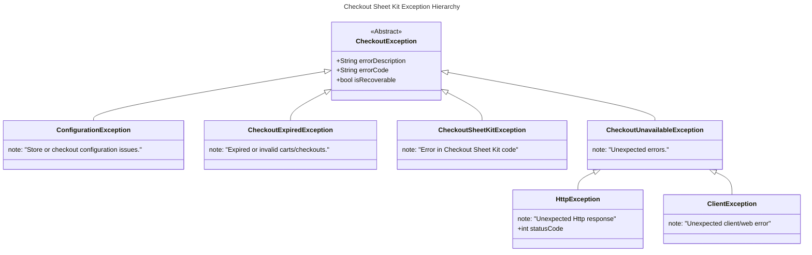

# Shopify Checkout Sheet Kit - Android

[](/LICENSE)

[]()


**Shopify's Checkout Sheet Kit for Android** is a library that enables Android apps to provide the world's highest converting, customizable, one-page checkout within an app. The presented experience is a fully-featured checkout that preserves all of the store customizations: Checkout UI extensions, Functions, Web Pixels, and more. It also provides idiomatic defaults such as support for light and dark mode, and convenient developer APIs to embed, customize and follow the lifecycle of the checkout experience. Check out our developer blog to [learn how Checkout Sheet Kit is built](https://www.shopify.com/partners/blog/mobile-checkout-sdks-for-ios-and-android).

- [Requirements](#requirements)
- [Getting Started](#getting-started)
  - [Gradle](#gradle)
  - [Maven](#maven)
- [Basic Usage](#basic-usage)
- [Configuration](#configuration)
  - [Color Scheme](#color-scheme)
    - [Checkout Dialog Title](#checkout-dialog-title)
- [Preloading](#preloading)
  - [Important considerations](#important-considerations)
  - [Flash Sales](#flash-sales)
  - [When to preload](#when-to-preload)
  - [Cache invalidation](#cache-invalidation)
  - [Lifecycle management for preloaded checkout](#lifecycle-management-for-preloaded-checkout)
    - [Additional considerations for preloaded checkout](#additional-considerations-for-preloaded-checkout)
- [Monitoring the lifecycle of a checkout session](#monitoring-the-lifecycle-of-a-checkout-session)
  - [Error handling](#error-handling)
    - [`CheckoutException`](#checkoutexception)
    - [Exception Hierarchy](#exception-hierarchy)
  - [Integrating with Web Pixels, monitoring behavioral data](#integrating-with-web-pixels-monitoring-behavioral-data)
- [Integrating identity \& customer accounts](#integrating-identity--customer-accounts)
  - [Cart: buyer bag, identity, and preferences](#cart-buyer-bag-identity-and-preferences)
  - [Multipass](#multipass)
  - [Shop Pay](#shop-pay)
  - [Customer Account API](#customer-account-api)
- [Contributing](#contributing)
- [License](#license)

## Requirements

- JDK 17+
- Android SDK 23+
- The SDK is not compatible with checkout.liquid. The Shopify Store must be migrated for extensibility

## Getting Started

The SDK is an [open source Android library](https://central.sonatype.com/artifact/com.shopify/checkout-sheet-kit). As a quick start, see
[sample projects](samples/README.md) or use one of the following ways to integrate the SDK into
your project:

### Gradle

```groovy
implementation "com.shopify:checkout-sheet-kit:3.3.0"
```

### Maven

```xml

<dependency>
   <groupId>com.shopify</groupId>
   <artifactId>checkout-sheet-kit</artifactId>
   <version>3.3.0</version>
</dependency>
```

## Basic Usage

Once the SDK has been added as a dependency, you can import the library:

```kotlin
import com.shopify.checkoutsheetkit.ShopifyCheckoutSheetKit
```

To present a checkout to the buyer, your application must first obtain a checkout URL.
The most common way is to use the [Storefront GraphQL API](https://shopify.dev/docs/api/storefront)
to assemble a cart (via `cartCreate` and related update mutations) and query the
[checkoutUrl](https://shopify.dev/docs/api/storefront/2023-10/objects/Cart#field-cart-checkouturl).
You can use any GraphQL client to accomplish this and we recommend
Shopify's [Mobile Buy SDK for Android](https://github.com/Shopify/mobile-buy-sdk-android) to
simplify the development workflow:

```kotlin

val client = GraphClient.build(
    context = applicationContext,
    shopDomain = "yourshop.myshopify.com",
    accessToken = "<storefront access token>"
)

val cartQuery = Storefront.query { query ->
    query.cart(ID(id)) {
        it.checkoutUrl()
    }
}

client.queryGraph(cartQuery).enqueue {
    if (it is GraphCallResult.Success) {
        val checkoutUrl = it.response.data?.cart?.checkoutUrl
    }
}
```

The `checkoutUrl` object is a standard web checkout URL that can be opened in any browser.
To present a native checkout dialog in your Android application, provide
the `checkoutUrl` alongside optional runtime configuration settings to the `present(checkoutUrl)`
function provided by the SDK:

```kotlin
fun presentCheckout() {
    val checkoutUrl = cart.checkoutUrl
    ShopifyCheckoutSheetKit.present(checkoutUrl, context, checkoutEventProcessor)
}
```

> [!TIP]
> To help optimize and deliver the best experience the SDK also provides a
> [preloading API](#preloading) that can be used to initialize the checkout session ahead of time.

## Configuration

The SDK provides a way to customize the presented checkout experience via
the `ShopifyCheckoutSheetKit.configure` function.

### Color Scheme

By default, the SDK will match the user's device color appearance. This behavior can be customized
via the `colorScheme` property:

```kotlin
ShopifyCheckoutSheetKit.configure {
    // [Default] Automatically toggle idiomatic light and dark themes based on device preference.
    it.colorScheme = ColorScheme.Automatic()

    // Force idiomatic light color scheme
    it.colorScheme = ColorScheme.Light()

    // Force idiomatic dark color scheme
    it.colorScheme = ColorScheme.Dark()

    // Force web theme, as rendered by a mobile browser
    it.colorScheme = ColorScheme.Web()

    // Force web theme, passing colors for the modal header and background
    it.colorScheme = ColorScheme.Web(
        Colors(
            webViewBackground = Color.ResourceId(R.color.web_view_background),
            headerFont = Color.ResourceId(R.color.header_font),
            headerBackground = Color.ResourceId(R.color.header_background),
            progressIndicator = Color.ResourceId(R.color.progress_indicator),
        )
    )
}
```

> [!Tip]
> Colors can also be specified in sRGB format (e.g. `Color.SRGB(-0xff0001)`) and can also be overridden for Light/Dark/Automatic themes, (see example below)

```kotlin
val automatic = ColorScheme.Automatic(
    lightColors = Colors(
        headerBackground = Color.ResourceId(R.color.headerLight),
        headerFont = Color.ResourceId(R.color.headerFontLight),
        webViewBackground = Color.ResourceId(R.color.webViewBgLight),
        progressIndicator = Color.ResourceId(R.color.indicatorLight),
    ),
    darkColors = Colors(
        headerBackground = Color.ResourceId(R.color.headerDark),
        headerFont = Color.ResourceId(R.color.headerFontDark,
        webViewBackground = Color.ResourceId(R.color.webViewBgDark),
        progressIndicator = Color.ResourceId(R.color.indicatorDark),
    )
)
```

The colors that can be modified are:

- headerBackground - Used to customize the background of the app bar on the dialog,
- headerFont - Used to customize the font color of the header text within in the app bar,
- webViewBackground - Used to customize the background color of the WebView,
- progressIndicator - Used to customize the color of the progress indicator shown when checkout is loading.

The current configuration can be obtained by calling `ShopifyCheckoutSheetKit.getConfiguration()`.

#### Checkout Dialog Title

To customize the title of the Dialog that the checkout WebView is displayed within, or to provide different values for the various locales your app supports, override the `checkout_web_view_title` String resource in your application, e.g:

```xml
<string name="checkout_web_view_title">Buy Now!</string>
```

## Preloading

Initializing a checkout session requires communicating with Shopify servers, thus depending
on the network quality and bandwidth available to the buyer can result in undesirable waiting
time for the buyer. To help optimize and deliver the best experience, the SDK provides a
`preloading` "hint" that allows developers to signal that the checkout session should be
initialized in the background, ahead of time.

Preloading is an advanced feature that can be disabled via a runtime flag:

```kotlin
ShopifyCheckoutSheetKit.configure {
    it.preloading = Preloading(enabled = false) // defaults to true
}
```

Once enabled, preloading a checkout is as simple as calling
`preload(checkoutUrl)` with a valid `checkoutUrl`.

```kotlin
ShopifyCheckoutSheetKit.preload(checkoutUrl)
```

Setting enabled to `false` will cause all calls to the `preload` function to be ignored. This allows the application to selectively toggle preloading behavior as a remote feature flag or dynamically in response to client conditions - e.g. when data saver functionality is enabled by the user.

```kotlin
ShopifyCheckoutSheetKit.configure {
    it.preloading = Preloading(enabled = false)
}
ShopifyCheckoutSheetKit.preload(checkoutUrl) // no-op
```

### Important considerations

1. Initiating preload results in background network requests and additional
   CPU/memory utilization for the client, and should be used when there is a
   high likelihood that the buyer will soon request to checkout—e.g. when the
   buyer navigates to the cart overview or a similar app-specific experience.
2. A preloaded checkout session reflects the cart contents at the time when
   `preload` is called. If the cart is updated after `preload` is called, the
   application needs to call `preload` again to reflect the updated checkout
   session.
3. Calling `preload(checkoutUrl)` is a hint, **not a guarantee**: the library
   may debounce or ignore calls to this API depending on various conditions; the
   preload may not complete before `present(checkoutUrl)` is called, in which
   case the buyer may still see a spinner while the checkout session is
   finalized.

### Flash Sales

It is important to note that during Flash Sales or periods of high amounts of traffic, buyers may be entered into a queue system.

**Calls to preload which result in a buyer being enqueued will be rejected.** This means that a buyer will never enter the queue without their knowledge.

### When to preload

Calling `preload()` each time an item is added to a buyer's cart can put significant strain on Shopify systems, which in return can result in rejected requests. Rejected requests will not result in a visual error shown to users, but will degrade the experience since they will need to load checkout from scratch.

Instead, a better approach is to call `preload()` when you have a strong enough signal that the buyer intends to check out. In some cases this might mean a buyer has navigated to a "cart" screen.

### Cache invalidation

Should you wish to manually clear the preload cache, there is a `ShopifyCheckoutSheetKit.invalidate()` helper function to do so. This function will be a no-op if no checkout is preloaded.

You may wish to do this if the buyer changes shortly before entering checkout, e.g. by changing cart quantity on a cart view.

### Lifecycle management for preloaded checkout

Preloading renders a checkout in a background webview, which is brought to foreground when `ShopifyCheckoutSheetKit.present()` is called. The content of preloaded checkout reflects the state of the cart when `preload()` was initially called. If the cart is mutated after `preload()` is called, the application is responsible for invalidating the preloaded checkout to ensure that up-to-date checkout content is displayed to the buyer:

1. To update preloaded contents: call `preload()` once again
2. To disable preloaded content: toggle the preload configuration setting

The library will automatically invalidate/abort preload under the following conditions:

- Request results in network error or non 2XX server response code
- The checkout has successfully completed, as indicated by the server response
- When `ShopifyCheckoutSheet.configure` is called (e.g. with theming changes).

A preloaded checkout _is not_ automatically invalidated when checkout is closed. For example, if a buyer loads the checkout then exists, the preloaded checkout is retained and should be updated when cart contents change.

#### Additional considerations for preloaded checkout

1. Preloading is a hint, not a guarantee. The library may debounce or ignore
   calls depending on various conditions; the preload may not complete before
   `present(checkoutUrl)` is called, in which case the buyer may still see a progress/loading indicator while the checkout session is finalized.
2. Preloading results in background network requests and additional CPU/memory utilization
   for the client, and should be used responsibly. For example, conditionally based on the state of the client and when there is a high likelihood that the buyer will soon
   request to checkout.

## Monitoring the lifecycle of a checkout session

Extend the `DefaultCheckoutEventProcessor` abstract class to register callbacks for key lifecycle events during the checkout session:

```kotlin
val processor = object : DefaultCheckoutEventProcessor(activity) {
    override fun onCheckoutCompleted(checkoutCompletedEvent: CheckoutCompletedEvent) {
        // Called when the checkout was completed successfully by the buyer.
        // Use this to update UI, reset cart state, etc.
    }

    override fun onCheckoutCanceled() {
        // Called when the checkout was canceled by the buyer.
        // Note: This will also be received after closing a completed checkout
    }

    override fun onCheckoutFailed(error: CheckoutException) {
        /**
         * Called when the checkout encountered an error and has been aborted.
         */

    override fun onCheckoutLinkClicked(uri: Uri) {
        // Called when the buyer clicks a link within the checkout experience:
        // - email address (`mailto:`)
        // - telephone number (`tel:`)
        // - web (http:)
        // - deep link (e.g. myapp://checkout)
        // and is being directed outside the application.

        // Note: to support deep links on Android 11+ using the `DefaultCheckoutEventProcessor`,
        // the client app should add a queries element in its manifest declaring which apps it should interact with.
        // See the MobileBuyIntegration sample's manifest for an example.
        // Queries reference - https://developer.android.com/guide/topics/manifest/queries-element

        // If no app can be queried to deal with the link, the processor will log a warning:
        // `Unrecognized scheme for link clicked in checkout` along with the uri.
    }

    override fun onWebPixelEvent(event: PixelEvent) {
        // Called when a web pixel event is emitted in checkout.
        // Use this to submit events to your analytics system, see below.
    }

    override fun onShowFileChooser(
        webView: WebView,
        filePathCallback: ValueCallback<Array<Uri>>,
        fileChooserParams: FileChooserParams,
    ): Boolean {
        // Called to tell the client to show a file chooser. This is called to handle HTML forms with 'file' input type,
        // in response to the user pressing the "Select File" button.
        // To cancel the request, call filePathCallback.onReceiveValue(null) and return true.
    }


    override fun onGeolocationPermissionsShowPrompt(origin: String, callback: GeolocationPermissions.Callback) {
        // Called to tell the client to show a geolocation permissions prompt as a geolocation permissions
        // request has been made.
        // Invoked for example if a customer uses `Use my location` for pickup points
    }

       override fun onGeolocationPermissionsHidePrompt() {
        // Called to tell the client to hide the geolocation permissions prompt, e.g. as the request has been cancelled
    }

    override fun onPermissionRequest(permissionRequest: PermissionRequest) {
        // Called when a permission has been requested, e.g. to access the camera
        // implement to grant/deny/request permissions.
    }
}
```

> [!Note]
> The `DefaultCheckoutEventProcessor` provides default implementations for current and future callback functions (such as `onLinkClicked()`), which can be overridden by clients wanting to change default behavior.

### Error handling

In the event of a checkout error occurring, the Checkout Sheet Kit _may_ attempt to retry to recover from the error. Recovery will happen in the background by discarding the failed WebView and creating a new "recovery" instance. Recovery will be attempted in the following scenarios:

- The WebView receives a 5XX status code
- An internal SDK error is emitted

There are some caveats to note when this scenario occurs:

1. The checkout experience may look different to buyers. Though the sheet kit will attempt to load any checkoput customizations for the storefront, there is no guarantee they will show in recovery mode.
2. The `onCheckoutCompleted(checkoutCompletedEvent: CheckoutCompletedEvent)` will be emitted with partial data. Invocations will only received the order ID via `checkoutCompletedEvent.orderDetails.id`.
3. `onWebPixelEvent(event: PixelEvent)` lifecycle methods will **not** be emitted.

Should you wish to opt-out of this fallback experience entirely, you can do so by overriding `shouldRecoverFromError`. Errors given to the `onCheckoutFailed(error: CheckoutException)` lifecycle method will contain an `isRecoverable` property by default indicating whether the request should be retried or not.

`preRecoveryActions()` can also be overridden to execute code before a fallback takes place, for example to add logging, or clear up any potentially problematic state such as in cookies. By default this function is a no-op.

```kotlin
ShopifyCheckoutSheetKit.configure {
    it.errorRecovery = object: ErrorRecovery {
        override fun shouldRecoverFromError(checkoutException: CheckoutException): Boolean {
            // To disable recovery (default = checkoutException.isRecoverable)
            return false
        }

        override fun preRecoveryActions(exception: CheckoutException, checkoutUrl: String) {
            // Perform actions prior to recovery, e.g. logging, clearing up cookies:
            if (exception is HttpException) {
                CookiePurger.purge(checkoutUrl)
            }
        }
    }
}
```

#### `CheckoutException`

| Exception Class                | Error Code                     | Description                                                                   | Recommendation                                                                                    |
| ------------------------------ | ------------------------------ | ----------------------------------------------------------------------------- | ------------------------------------------------------------------------------------------------- |
| `ConfigurationException`       | 'checkout_liquid_not_migrated' | `checkout.liquid` is not supported.                                           | Upgrade to Extensibility.                                                                         |
| `ConfigurationException`       | 'storefront_password_required' | Access to checkout is password protected.                                     | We are working on ways to enable the Checkout Sheet Kit for usage with password protected stores. |
| `ConfigurationException`       | 'unknown'                      | Other configuration issue, see error details for more info.                   | Resolve the configuration issue in the error message.                                             |
| `CheckoutExpiredException`     | 'cart_expired'                 | The cart or checkout is no longer available.                                  | Create a new cart and open a new checkout URL.                                                    |
| `CheckoutExpiredException`     | 'cart_completed'               | The cart associated with the checkout has completed checkout.                 | Create new cart and open a new checkout URL.                                                      |
| `CheckoutExpiredException`     | 'invalid_cart'                 | The cart associated with the checkout is invalid (e.g. empty).                | Create a new cart and open a new checkout URL.                                                    |
| `CheckoutSheetKitException`    | 'error_receiving_message'      | Checkout Sheet Kit failed to receive a message from checkout.                 | Show checkout in a fallback WebView.                                                              |
| `CheckoutSheetKitException`    | 'error_sending_message'        | Checkout Sheet Kit failed to send a message to checkout.                      | Show checkout in a fallback WebView.                                                              |
| `CheckoutSheetKitException`    | 'render_process_gone'          | The render process for the checkout WebView is gone.                          | Show checkout in a fallback WebView.                                                              |
| `CheckoutSheetKitException`    | 'unknown'                      | An error in Checkout Sheet Kit has occurred, see error details for more info. | Show checkout in a fallback WebView.                                                              |
| `HttpException`                | 'http_error'                   | An unexpected server error has been encountered.                              | Show checkout in a fallback WebView.                                                              |
| `ClientException`              | 'client_error'                 | An unhandled client error was encountered.                                    | Show checkout in a fallback WebView.                                                              |
| `CheckoutUnavailableException` | 'unknown'                      | Checkout is unavailable for another reason, see error details for more info.  | Show checkout in a fallback WebView.                                                              |

#### Exception Hierarchy



### Integrating with Web Pixels, monitoring behavioral data

App developers can use [lifecycle events](#monitoring-the-lifecycle-of-a-checkout-session) to
monitor and log the status of a checkout session.

For behavioral monitoring, [standard](https://shopify.dev/docs/api/web-pixels-api/standard-events) and [custom](https://shopify.dev/docs/api/web-pixels-api/emitting-data) Web Pixel events will be relayed back to your application through the `onWebPixelEvent` checkout event processor function. The responsibility then falls on the application developer to ensure adherence to local regulations like GDPR and ePrivacy directive before disseminating these events to first-party and third-party systems.

Here's how you might intercept these events:

```kotlin
fun onWebPixelEvent(event: PixelEvent) {
    if (!hasPermissionToCaptureEvents()) {
        return
    }

    when (event) {
        is StandardPixelEvent -> processStandardEvent(event)
        is CustomPixelEvent -> processCustomEvent(event)
    }
}

fun processStandardEvent(event: StandardPixelEvent) {
    const endpoint = "https://example.com/pixel?id=${accountID}&uid=${userId}";

    val payload = AnalyticsPayload(
        eventTime: event.timestamp,
        action: event.name,
        details: event.data.checkout
    )

    // Send events to third-party servers
    httpClient.post(endpoint, payload)
}

// ... other functions, incl. processCustomEvent(event)
```

> [!Note]
> You may need to augment these events with customer/session information derived from app state.

> [!Note]
> The `customData` attribute of CustomPixelEvent can take on any shape. As such, this attribute will be returned as a String. Client applications should define a custom data type and deserialize the `customData` string into that type.

## Integrating identity & customer accounts

Buyer-aware checkout experience reduces friction and increases conversion. Depending on the context
of the buyer (guest or signed-in), knowledge of buyer preferences, or account/identity system, the
application can use on of the following methods to initialize personalized and contextualized buyer
experience.

### Cart: buyer bag, identity, and preferences

In addition to specifying the line items, the Cart can include buyer identity (name, email, address,
etc.), and delivery and payment preferences:
see [guide](https://shopify.dev/docs/custom-storefronts/building-with-the-storefront-api/cart/manage).
Included information will be used to present pre-filled and pre-selected choices to the buyer within
checkout.

### Multipass

[Shopify Plus](https://help.shopify.com/en/manual/intro-to-shopify/pricing-plans/plans-features/shopify-plus-plan)
merchants
using [Classic Customer Accounts](https://help.shopify.com/en/manual/customers/customer-accounts/classic-customer-accounts)
can use [Multipass](https://shopify.dev/docs/api/multipass) to integrate an external identity system
and initialize a buyer-aware checkout session.

```json
{
  "email": "<Customer's email address>",
  "created_at": "<Current timestamp in ISO8601 encoding>",
  "remote_ip": "<Client IP address>",
  "return_to": "<Checkout URL obtained from Storefront API>",
  ...
}
```

1. Follow the [Multipass documentation](https://shopify.dev/docs/api/multipass) to create a
   multipass
   URL and set the `'return_to'` to be the obtained `checkoutUrl`
2. Provide the Multipass URL to `ShopifyCheckoutSheetKit.present()`.

> [!Important]
> the above JSON omits useful customer attributes that should be provided where possible and
> encryption and signing should be done server-side to ensure Multipass keys are kept secret.

> [!NOTE]
> Multipass errors are not "recoverable" (See [Error Handling](#error-handling)) due to their one-time nature. Failed requests containing multipass URLs
> will require re-generating new tokens.

### Shop Pay

To initialize accelerated Shop Pay checkout, the cart can set a
[walletPreference](https://shopify.dev/docs/api/storefront/latest/mutations/cartBuyerIdentityUpdate#field-cartbuyeridentityinput-walletpreferences)
to 'shop_pay'. The sign-in state of the buyer is app-local and the buyer will be prompted to sign in
to their Shop account on their first checkout, and their sign-in state will be remembered for future
checkout sessions.

### Customer Account API

We are working on a library to provide buyer sign-in and authentication powered by the
[new Customer Account API](https://www.shopify.com/partners/blog/introducing-customer-account-api-for-headless-stores)
—stay tuned.

---

## Contributing

We welcome code contributions, feature requests, and reporting of issues. Please
see [guidelines and instructions](.github/CONTRIBUTING.md).

## License

Shopify's Checkout Sheet Kit is provided under an [MIT License](LICENSE).
